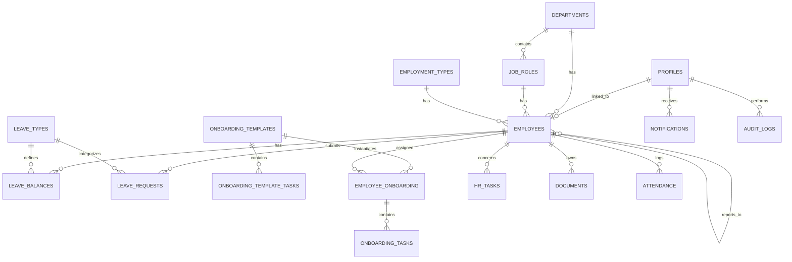

# SimpleHR — Architecture & Planning Document

**Status:** Planning phase (pre-implementation). Nothing here is code you need to run yet — review it, tell me what to adjust, and we start Phase 1 build.

---

## 1. System Architecture

SimpleHR is a static single-page app talking directly to Supabase. There is no custom backend server — Postgres (with Row Level Security) *is* the authorization layer.

```
┌─────────────────────────────┐
│   Browser (React + Vite)    │
│  Tailwind + shadcn/ui        │
│  React Router + TanStack Q   │
└──────────────┬───────────────┘
               │ HTTPS (anon key only)
               ▼
┌─────────────────────────────────────────┐
│                Supabase                  │
│  ┌─────────────┐  ┌───────────────────┐ │
│  │  Postgres    │  │  Auth              │ │
│  │  + RLS       │  │  (email/password)  │ │
│  └─────────────┘  └───────────────────┘ │
│  ┌─────────────┐  ┌───────────────────┐ │
│  │  Storage     │  │  DB Functions/     │ │
│  │  (documents) │  │  Triggers          │ │
│  └─────────────┘  └───────────────────┘ │
└─────────────────────────────────────────┘
```

**Why no custom backend?** Everything the app needs (auth, relational data, file storage, row-level permissions) is covered by Supabase's free tier. Adding an Express/Node API in between would mean re-implementing auth and permission checks that Postgres can already enforce — extra infrastructure with no real benefit for a <50-person company. If a future feature genuinely needs server-side logic Supabase can't do (e.g. a scheduled job), we'll use a Supabase Edge Function rather than standing up a separate server.

**Key principle:** the frontend is a *view* over the database, not the security boundary. Every permission rule is enforced again in Postgres via RLS, so a bug in a React component can never leak another employee's data — worst case, a query returns zero rows.

---

## 2. Feature Map

| Module | Included in v1 | Build Phase |
|---|---|---|
| Auth & roles | ✅ | 1 |
| Dashboard | ✅ | 2 |
| Employee directory & profiles | ✅ | 2 |
| Departments & job roles | ✅ | 2 |
| Leave requests, balances, approvals | ✅ | 3 |
| Leave calendar | ✅ | 3 |
| Onboarding templates & tracking | ✅ | 4 |
| HR tasks | ✅ | 4 |
| In-app notifications | ✅ | 4 |
| Employee documents | ✅ | 5 |
| Attendance (check-in/out) | ✅ | 5 |
| Company calendar | ✅ | 5 |
| Reports + CSV export | ✅ | 6 |
| Audit log | ✅ | 6 |
| Settings (company, leave types, users) | ✅ | 6 |
| Payroll, recruitment/ATS, performance reviews, email/SMS integrations | ❌ (deferred, see §33 of the brief) | — |

---

## 3. Recommended Folder Structure

```
simplehr/
├── src/
│   ├── components/
│   │   ├── ui/              # shadcn/ui primitives (button, dialog, table…)
│   │   ├── layout/           # Sidebar, Topbar, MobileNav, AppShell
│   │   └── common/            # EmptyState, ConfirmDialog, StatusBadge, LoadingSpinner, ErrorState
│   ├── features/
│   │   ├── auth/
│   │   ├── dashboard/
│   │   ├── employees/
│   │   │   ├── components/
│   │   │   ├── hooks/         # useEmployees, useEmployee
│   │   │   ├── services/      # employees.api.ts (all Supabase calls live here)
│   │   │   ├── types/
│   │   │   └── pages/
│   │   ├── departments/
│   │   ├── job-roles/
│   │   ├── leave/
│   │   ├── onboarding/
│   │   ├── tasks/
│   │   ├── attendance/
│   │   ├── documents/
│   │   ├── calendar/
│   │   ├── reports/
│   │   ├── settings/
│   │   └── audit-log/
│   ├── hooks/                # useAuth, useCurrentProfile, useRole (cross-feature)
│   ├── lib/                  # supabaseClient.ts, queryClient.ts, cn.ts
│   ├── routes/                # AppRoutes.tsx, ProtectedRoute.tsx, RoleGuard.tsx
│   ├── types/                 # database.types.ts (generated), shared domain types
│   └── utils/                 # date helpers, working-days calculator, formatters
├── supabase/
│   ├── migrations/            # numbered SQL migration files
│   └── seed.sql                # demo data (~20 fictional employees)
├── tests/                      # Vitest + RTL unit/integration tests
├── e2e/                         # Playwright specs
├── .env.example
└── README.md
```

**Rule of thumb:** every feature folder owns its own `services/` (Supabase queries), `hooks/` (TanStack Query wrappers), and `components/`. Nothing outside a feature imports its internals directly — only through the feature's public exports. This keeps things swappable later (e.g. if leave management ever needs to move behind a real API).

---

## 4. Database ERD (Entity Overview)



`calendar_events` and `company_settings` are standalone (no strong FK relationships) and are omitted from the diagram for readability — full columns are in §5.

---

## 5. PostgreSQL Schema (DDL)

This is close to final — it's what Phase 1's migration file will contain, with `updated_at` triggers added at implementation time (one trigger function, applied per table, omitted below for readability).

```sql
-- ============ EXTENSIONS ============
create extension if not exists pgcrypto;

-- ============ ENUM TYPES ============
create type user_role as enum ('super_admin','hr_admin','manager','employee');
create type employment_status as enum ('active','on_leave','suspended','terminated');
create type leave_status as enum ('pending','approved','rejected','cancelled');
create type onboarding_status as enum ('not_started','in_progress','completed','overdue');
create type task_priority as enum ('low','medium','high','urgent');
create type hr_task_status as enum ('to_do','in_progress','completed','cancelled');
create type document_visibility as enum ('employee_only','manager_hr','hr_only');
create type onboarding_assignee_role as enum ('hr','manager','employee','specific');
create type calendar_event_type as enum ('company_event','holiday');

-- ============ EMPLOYMENT TYPES ============
create table employment_types (
  id uuid primary key default gen_random_uuid(),
  name text not null unique,
  description text,
  is_active boolean not null default true,
  created_at timestamptz not null default now()
);

-- ============ DEPARTMENTS (head FK added after employees exists) ============
create table departments (
  id uuid primary key default gen_random_uuid(),
  name text not null unique,
  description text,
  department_head_id uuid,
  is_active boolean not null default true,
  created_at timestamptz not null default now(),
  updated_at timestamptz not null default now()
);

-- ============ JOB ROLES ============
create table job_roles (
  id uuid primary key default gen_random_uuid(),
  title text not null,
  department_id uuid not null references departments(id) on delete restrict,
  description text,
  default_employment_type_id uuid references employment_types(id) on delete set null,
  is_active boolean not null default true,
  created_at timestamptz not null default now(),
  updated_at timestamptz not null default now(),
  unique (title, department_id)
);

-- ============ PROFILES (1:1 with auth.users) ============
create table profiles (
  id uuid primary key references auth.users(id) on delete cascade,
  role user_role not null default 'employee',
  full_name text not null,
  avatar_url text,
  is_active boolean not null default true,
  created_at timestamptz not null default now(),
  updated_at timestamptz not null default now()
);

-- ============ EMPLOYEES (the core HR record) ============
create table employees (
  id uuid primary key default gen_random_uuid(),
  profile_id uuid unique references profiles(id) on delete set null,
  employee_number text not null unique,
  first_name text not null,
  last_name text not null,
  preferred_name text,
  email text not null unique,
  phone text,
  date_of_birth date,
  address text,
  emergency_contact_name text,
  emergency_contact_phone text,
  emergency_contact_relationship text,
  department_id uuid references departments(id) on delete set null,
  job_role_id uuid references job_roles(id) on delete set null,
  employment_type_id uuid references employment_types(id) on delete set null,
  manager_id uuid references employees(id) on delete set null,
  employment_status employment_status not null default 'active',
  start_date date not null,
  end_date date,
  location text,
  avatar_url text,
  notes text,                 -- HR-only private notes, never shown to the employee
  created_at timestamptz not null default now(),
  updated_at timestamptz not null default now(),
  deleted_at timestamptz,      -- soft delete
  constraint chk_end_after_start check (end_date is null or end_date >= start_date)
);
create index idx_employees_department on employees(department_id);
create index idx_employees_manager on employees(manager_id);
create index idx_employees_status on employees(employment_status);

alter table departments
  add constraint fk_department_head foreign key (department_head_id)
  references employees(id) on delete set null;

-- ============ LEAVE ============
create table leave_types (
  id uuid primary key default gen_random_uuid(),
  name text not null unique,
  description text,
  default_annual_allowance numeric(5,1) not null default 0,
  requires_approval boolean not null default true,
  color text default '#64748b',
  is_active boolean not null default true,
  created_at timestamptz not null default now()
);

create table leave_balances (
  id uuid primary key default gen_random_uuid(),
  employee_id uuid not null references employees(id) on delete cascade,
  leave_type_id uuid not null references leave_types(id) on delete cascade,
  year int not null,
  allocated_days numeric(5,1) not null default 0,
  used_days numeric(5,1) not null default 0,
  carried_over_days numeric(5,1) not null default 0,
  adjusted_days numeric(5,1) not null default 0,
  created_at timestamptz not null default now(),
  updated_at timestamptz not null default now(),
  unique (employee_id, leave_type_id, year)
);

create table leave_requests (
  id uuid primary key default gen_random_uuid(),
  employee_id uuid not null references employees(id) on delete cascade,
  leave_type_id uuid not null references leave_types(id) on delete restrict,
  start_date date not null,
  end_date date not null,
  total_days numeric(5,1) not null,   -- computed client+server side (working days)
  reason text,
  status leave_status not null default 'pending',
  approver_id uuid references employees(id) on delete set null,
  approved_at timestamptz,
  decision_comment text,
  created_at timestamptz not null default now(),
  updated_at timestamptz not null default now(),
  constraint chk_leave_dates check (end_date >= start_date)
);
create index idx_leave_requests_employee on leave_requests(employee_id);
create index idx_leave_requests_status on leave_requests(status);

-- ============ ONBOARDING ============
create table onboarding_templates (
  id uuid primary key default gen_random_uuid(),
  name text not null,
  description text,
  is_active boolean not null default true,
  created_by uuid references profiles(id) on delete set null,
  created_at timestamptz not null default now(),
  updated_at timestamptz not null default now()
);

create table onboarding_template_tasks (
  id uuid primary key default gen_random_uuid(),
  template_id uuid not null references onboarding_templates(id) on delete cascade,
  title text not null,
  description text,
  day_offset int not null default 0,   -- days after employee start date
  assigned_role onboarding_assignee_role not null default 'hr',
  priority task_priority not null default 'medium',
  order_index int not null default 0,
  created_at timestamptz not null default now()
);

create table employee_onboarding (
  id uuid primary key default gen_random_uuid(),
  employee_id uuid not null references employees(id) on delete cascade,
  template_id uuid references onboarding_templates(id) on delete set null,
  start_date date not null,
  status onboarding_status not null default 'not_started',
  created_at timestamptz not null default now(),
  updated_at timestamptz not null default now(),
  unique (employee_id, template_id)
);

create table onboarding_tasks (
  id uuid primary key default gen_random_uuid(),
  employee_onboarding_id uuid not null references employee_onboarding(id) on delete cascade,
  template_task_id uuid references onboarding_template_tasks(id) on delete set null,
  title text not null,
  description text,
  assigned_to uuid references profiles(id) on delete set null,
  due_date date,
  priority task_priority not null default 'medium',
  status onboarding_status not null default 'not_started',
  completed_at timestamptz,
  created_at timestamptz not null default now(),
  updated_at timestamptz not null default now()
);
create index idx_onboarding_tasks_assignee on onboarding_tasks(assigned_to);

-- ============ HR TASKS ============
create table hr_tasks (
  id uuid primary key default gen_random_uuid(),
  title text not null,
  description text,
  assignee_id uuid references profiles(id) on delete set null,
  related_employee_id uuid references employees(id) on delete set null,
  due_date date,
  priority task_priority not null default 'medium',
  status hr_task_status not null default 'to_do',
  created_by uuid references profiles(id) on delete set null,
  created_at timestamptz not null default now(),
  updated_at timestamptz not null default now()
);
create index idx_hr_tasks_assignee on hr_tasks(assignee_id);

-- ============ DOCUMENTS ============
create table documents (
  id uuid primary key default gen_random_uuid(),
  employee_id uuid not null references employees(id) on delete cascade,
  document_name text not null,
  document_type text not null,
  file_path text not null,               -- path inside the Supabase Storage bucket
  uploaded_by uuid references profiles(id) on delete set null,
  visibility document_visibility not null default 'hr_only',
  uploaded_at timestamptz not null default now()
);
create index idx_documents_employee on documents(employee_id);

-- ============ ATTENDANCE ============
create table attendance (
  id uuid primary key default gen_random_uuid(),
  employee_id uuid not null references employees(id) on delete cascade,
  work_date date not null,
  check_in_time timestamptz,
  check_out_time timestamptz,
  notes text,
  created_at timestamptz not null default now(),
  updated_at timestamptz not null default now(),
  unique (employee_id, work_date)
);
create index idx_attendance_date on attendance(work_date);

-- ============ CALENDAR (manual events only — see §8 notes) ============
create table calendar_events (
  id uuid primary key default gen_random_uuid(),
  title text not null,
  description text,
  event_type calendar_event_type not null default 'company_event',
  event_date date not null,
  end_date date,
  created_by uuid references profiles(id) on delete set null,
  created_at timestamptz not null default now()
);

-- ============ NOTIFICATIONS ============
create table notifications (
  id uuid primary key default gen_random_uuid(),
  recipient_id uuid not null references profiles(id) on delete cascade,
  type text not null,
  title text not null,
  message text,
  related_entity_type text,
  related_entity_id uuid,
  is_read boolean not null default false,
  created_at timestamptz not null default now()
);
create index idx_notifications_recipient on notifications(recipient_id, is_read);

-- ============ AUDIT LOG ============
create table audit_logs (
  id uuid primary key default gen_random_uuid(),
  actor_id uuid references profiles(id) on delete set null,
  action text not null,
  entity_type text not null,
  entity_id uuid,
  metadata jsonb,
  created_at timestamptz not null default now()
);
create index idx_audit_logs_entity on audit_logs(entity_type, entity_id);

-- ============ COMPANY SETTINGS (singleton row) ============
create table company_settings (
  id int primary key default 1,
  company_name text not null default 'My Company',
  logo_url text,
  address text,
  contact_email text,
  contact_phone text,
  date_format text not null default 'DD/MM/YYYY',
  timezone text not null default 'Africa/Lagos',
  created_at timestamptz not null default now(),
  updated_at timestamptz not null default now(),
  constraint chk_singleton check (id = 1)
);
```

### Notable design decisions (flagged because the brief was ambiguous here)

- **`employees` vs `profiles` are separate tables.** `profiles` is the thin auth-linked record (role + name, mirrors `auth.users`). `employees` is the full HR record. This matters because Super Admin accounts don't necessarily need to *be* an employee, and it lets HR create an employee record before that person even has login access (`profile_id` is nullable).
- **Directory privacy needs a view, not just RLS.** RLS filters *rows*, not columns. So an Employee can be allowed to see "all active employees" (for the directory) while still being blocked from their salary notes or address — that requires a `public_employee_directory` view exposing only safe columns, separate from raw `employees` table access. Detailed in §8.
- **Birthdays/anniversaries/leave on the calendar are computed, not stored.** Rather than duplicating data into `calendar_events`, the Calendar page will union: approved `leave_requests`, `employees.date_of_birth` (day/month match), `employees.start_date` (anniversaries), onboarding due dates, and HR task due dates — with `calendar_events` reserved for genuinely manual entries (company holidays, all-hands meetings).
- **Audit logs are trigger-populated, not client-inserted.** If the browser inserted its own audit rows, a compromised or buggy client could skip or fake them. Instead, Postgres triggers on `employees`, `leave_requests`, `documents`, etc. will write to `audit_logs` automatically using a `security definer` function — this happens in Phase 6 alongside the reports/settings module, when we'll ship the full trigger set.
- **`company_settings` is a single-row table** with a `check (id = 1)` constraint — the simplest reliable way to guarantee exactly one settings record in Postgres without a separate config service.

---

## 6. Role & Permission Matrix

| Action | Super Admin | HR/Admin | Manager | Employee |
|---|:---:|:---:|:---:|:---:|
| View/edit own profile & contact info | ✅ | ✅ | ✅ | ✅ |
| View employee directory (name, title, dept, work email) | ✅ | ✅ | ✅ | ✅ |
| View full HR record (DOB, address, notes, salary-adjacent data) | ✅ | ✅ | Own team only | ❌ |
| Create / edit / deactivate employees | ✅ | ✅ | ❌ | ❌ |
| Manage departments, job roles, employment types | ✅ | ✅ | ❌ | ❌ |
| Manage user accounts & roles | ✅ | ❌ | ❌ | ❌ |
| Edit company settings | ✅ | ❌ | ❌ | ❌ |
| Submit / cancel own leave request | ✅ | ✅ | ✅ | ✅ |
| Approve/reject leave requests | ✅ (all) | ✅ (all) | Own team only | ❌ |
| Manage leave types, policies, balances | ✅ | ✅ | ❌ | ❌ |
| View leave calendar | ✅ (all) | ✅ (all) | Own team | Own + company-wide approved |
| Create onboarding templates & assign onboarding | ✅ | ✅ | ❌ | ❌ |
| View/complete own onboarding tasks | ✅ | ✅ | ✅ | ✅ |
| View team onboarding progress | ✅ | ✅ | Own team only | ❌ |
| Create HR tasks | ✅ | ✅ | ❌ | ❌ |
| View/update tasks assigned to self | ✅ | ✅ | ✅ | ✅ |
| Upload employee documents | ✅ | ✅ | ❌ | ❌ |
| View a document | ✅ | ✅ | If shared with them | Own, if shared with them |
| Check in / check out | ✅ | ✅ | ✅ | ✅ |
| View team/company attendance | ✅ | ✅ | Own team only | ❌ (own history only) |
| View & export HR reports | ✅ | ✅ | ❌ | ❌ |
| View audit log | ✅ | ✅ (read-only) | ❌ | ❌ |

**Assumption flagged:** the brief doesn't explicitly say whether HR/Admin can see the audit log (only "authorized administrators" is mentioned). I've given HR/Admin read-only access since they're the day-to-day operators, while only Super Admin can... well, do anything requiring the log to be trustworthy against HR/Admin itself. Tell me if you'd rather restrict it to Super Admin only.

---

## 7. Application Routes

| Route | Page | Access |
|---|---|---|
| `/login` | Login | Public |
| `/dashboard` | Dashboard | All authenticated |
| `/profile` | My Profile | All authenticated |
| `/employees` | Employee Directory | All (columns scoped) |
| `/employees/new` | Add Employee | Super Admin, HR/Admin |
| `/employees/:id` | Employee Profile | Scoped (self / own manager / HR / Admin) |
| `/employees/:id/edit` | Edit Employee | Super Admin, HR/Admin |
| `/departments` | Departments | Super Admin, HR/Admin |
| `/job-roles` | Job Roles | Super Admin, HR/Admin |
| `/leave/requests` | Leave Requests | All (scoped) |
| `/leave/requests/new` | New Leave Request | All |
| `/leave/calendar` | Leave Calendar | All (scoped) |
| `/leave/balances` | Leave Balances | All (own); HR/Admin (all) |
| `/leave/types` | Leave Types & Policies | Super Admin, HR/Admin |
| `/onboarding` | Onboarding Overview | HR/Admin (all), Manager/Employee (scoped) |
| `/onboarding/templates` | Onboarding Templates | Super Admin, HR/Admin |
| `/tasks` | HR Tasks | HR/Admin (all); Manager/Employee (assigned) |
| `/attendance` | Attendance | All (scoped) |
| `/calendar` | Company Calendar | All |
| `/documents` | Documents | All (scoped) |
| `/reports` | Reports | Super Admin, HR/Admin |
| `/settings/company` | Company Settings | Super Admin |
| `/settings/users` | User & Role Management | Super Admin |
| `/settings/hr` | Leave Types / Departments / Job Roles / Employment Types | Super Admin, HR/Admin |
| `/audit-log` | Audit Log | Super Admin, HR/Admin (read-only) |
| `/unauthorized` | 403 | Any authenticated |
| `*` | 404 | Public |

`ProtectedRoute` checks `session != null`; `RoleGuard` wraps route elements with an allowed-roles list and redirects to `/unauthorized` otherwise. This is a UX convenience only — the real enforcement is RLS (§8).

---

## 8. Supabase RLS Strategy

**Approach:** RLS is enabled on every table with no default access; every allowed read/write is an explicit policy. Four helper SQL functions do the heavy lifting so policies stay short and consistent:

```sql
create or replace function auth_role() returns user_role
language sql stable security definer as $$
  select role from profiles where id = auth.uid();
$$;

create or replace function auth_employee_id() returns uuid
language sql stable security definer as $$
  select id from employees where profile_id = auth.uid();
$$;

create or replace function is_admin() returns boolean
language sql stable security definer as $$
  select auth_role() in ('super_admin', 'hr_admin');
$$;

create or replace function is_manager_of(target_employee_id uuid) returns boolean
language sql stable security definer as $$
  select exists (
    select 1 from employees
    where id = target_employee_id and manager_id = auth_employee_id()
  );
$$;
```

**Representative policies** (the full set — one SELECT/INSERT/UPDATE/DELETE policy per table — ships as part of the Phase 1 migration; these illustrate the pattern):

```sql
alter table employees enable row level security;

-- Admins see everything
create policy employees_select_admin on employees for select
  using (is_admin());

-- Managers see their direct reports
create policy employees_select_manager on employees for select
  using (auth_role() = 'manager' and manager_id = auth_employee_id());

-- Everyone sees their own full record
create policy employees_select_self on employees for select
  using (profile_id = auth.uid());

-- Only admins write
create policy employees_write_admin on employees for all
  using (is_admin()) with check (is_admin());
```

```sql
alter table leave_requests enable row level security;

create policy leave_select_scope on leave_requests for select
  using (
    is_admin()
    or employee_id = auth_employee_id()
    or is_manager_of(employee_id)
  );

create policy leave_insert_self on leave_requests for insert
  with check (employee_id = auth_employee_id() or is_admin());

-- Employees can only touch their own request while still pending (cancel)
create policy leave_update_self on leave_requests for update
  using (employee_id = auth_employee_id() and status = 'pending')
  with check (employee_id = auth_employee_id());

-- Managers/admins can change status on requests they're allowed to see
create policy leave_update_approver on leave_requests for update
  using (is_admin() or is_manager_of(employee_id));
```

```sql
-- Directory privacy: a VIEW exposes only safe columns to all authenticated users,
-- instead of relying on RLS to hide specific columns of the raw employees table.
create view public_employee_directory as
  select id, first_name, last_name, preferred_name, avatar_url,
         job_role_id, department_id, location, employment_status, email
  from employees
  where deleted_at is null;

grant select on public_employee_directory to authenticated;
```

**Other tables follow the same shapes:**
- Reference/lookup tables (`departments`, `job_roles`, `employment_types`, `leave_types`) — SELECT open to all authenticated users (needed for dropdowns), write restricted to `is_admin()`.
- `documents` — SELECT policy branches on the `visibility` column combined with ownership/management scope; INSERT restricted to `is_admin()`.
- `onboarding_tasks` / `hr_tasks` — SELECT/UPDATE allowed where `assigned_to = auth.uid()`, plus full access for `is_admin()` and scoped access for managers via `is_manager_of()`.
- `attendance` — employees can INSERT/UPDATE only their own row for *today's* date; admins can view/correct any row.
- `notifications` — a user can only SELECT/UPDATE (mark-read) rows where `recipient_id = auth.uid()`; inserts happen via triggers, not the client.
- `audit_logs` — SELECT restricted to `is_admin()`; INSERT happens only via `security definer` trigger functions attached to the tables being audited, never directly from the client.
- `company_settings` — SELECT open to all authenticated (needed for date format/timezone in the UI); UPDATE restricted to `super_admin` only.

---

## 9. Development Phases

Same phased plan as the brief, restated so we can track progress against it:

1. **Foundation** — Vite/Tailwind/shadcn setup, routing, Supabase project + client, full DB schema + RLS migration, auth (login/session), role-aware app shell (sidebar/topbar).
2. **People core** — Dashboard, Employee Directory (grid + table), Employee Profile, Departments, Job Roles.
3. **Leave** — Leave requests, balances, approval flow, Leave Calendar (month + list view).
4. **Workflows** — Onboarding templates + tracking, HR Tasks, in-app Notifications.
5. **Records & time** — Documents (Supabase Storage), Attendance, Company Calendar.
6. **Operations** — Reports + CSV export, Audit Log (trigger-based), Settings.
7. **Hardening** — Vitest/RTL unit tests, Playwright e2e for the critical flows (login, submit/approve leave, add employee), accessibility pass, mobile responsiveness pass, production cleanup.

Each phase ends with: compiles clean, no TypeScript errors, lint clean, manual test of the happy path + one permission-boundary test (e.g. "can Employee A load Employee B's `/employees/:id` by editing the URL?" — should get zero rows, not an error page bypass).

---

## 10. Free Deployment Strategy

**Backend — Supabase free tier.** As of 2026 this gets you 500 MB database storage, 1 GB file storage, 5 GB bandwidth/month, 50,000 monthly active users, and up to 2 active projects, with no credit card required. For a company under 50 employees this is comfortably enough — the one real gotcha is that a free project **auto-pauses after 7 days with no activity** and needs a manual resume from the dashboard (or a scheduled ping if you want to avoid that during quiet periods, e.g. company holidays).

**Frontend — Vercel, Netlify, or Cloudflare Pages** (pick one; Vercel is the path of least friction for a Vite app). All three offer a free tier for static/SPA hosting with a custom domain and no credit card. Deploy is: connect the GitHub repo → set `VITE_SUPABASE_URL` / `VITE_SUPABASE_ANON_KEY` as environment variables in the host's dashboard → every push to `main` redeploys automatically.

**Source control — GitHub** (free for private repos). CI can stay minimal at this size: a GitHub Actions workflow running `npm run build`, `npm run lint`, and `npm run test` on every PR is enough; no need for a separate CD pipeline since the host handles deploys on push.

**Cost ceiling:** ₦0 to run in production at this scale. The first thing that would force a paid plan is the 500 MB database cap — worth revisiting once real usage data exists, but for 50 employees plus a few years of leave/attendance/document-metadata history, that's a long way off.

---

## Next Steps

Review the above and flag anything you want changed — especially the two assumptions called out in §6 and §8 (audit log visibility, and the directory-view column list). Once you're happy with it, say the word and we start **Phase 1**: project scaffold, Supabase project setup, the migration file for everything in §5, and auth + the app shell.

When we get to actual UI components (Phase 2 onward), I'll lean on the project's frontend-design conventions to keep things looking like a considered SaaS product rather than a generic AI-generated dashboard — clean typography, restrained color, real empty/loading/error states — consistent with §20 of the brief.
